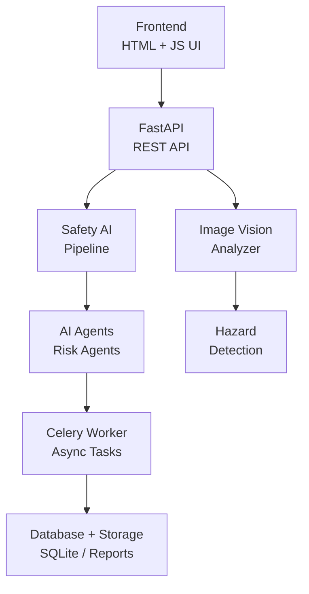

# AI Safety Report Platform

AI-powered compliance and safety analysis platform.

## Features

- AI image risk analysis
- Automated safety reports
- Compliance monitoring
- AI chat assistant
- Risk assessment engine

## Tech Stack

Frontend:
- HTML
- TailwindCSS
- JavaScript

Backend:
- FastAPI
- Python

Deployment:
- Docker
- GitHub Actions

## System Architecture



Architecture flow summary:
- Frontend pages call FastAPI endpoints for report generation, analytics, and validation.
- FastAPI routes orchestrate the safety pipeline and vision analysis modules.
- Pipeline logic delegates tasks to specialized AI agents.
- Long-running and asynchronous jobs are executed by Celery workers.
- Outputs, metadata, and generated reports are persisted in SQLite and storage folders.

Hazards Identified
• Working at height
• Electrical exposure

Risk Assessment
• Working at height → High Risk

Control Measures
• Install guard rails
• Provide safety harness

Compliance
WHS Regulation Part 4.4 – Falls

---


## Installation

1. Clone the repository:
	```bash
	git clone https://github.com/saikiranyt2001/safety-report-trial.git
	```
2. Install Python dependencies:
	```bash
	pip install -r requirements.txt
	```
3. Start backend (FastAPI):
	```bash
	uvicorn main:app --reload
	```
4. Start frontend:
	- Open `frontend/pages/dashboard.html` in the browser, or serve the `frontend` folder from the FastAPI app
5. (Optional) Start Celery workers and Flower for job monitoring
6. (Optional) Deploy with Docker:
	```bash
	docker-compose up --build
	```

## Usage

- Login with your credentials
- Generate safety reports for projects
- Ask safety questions to the AI Safety Advisor
- View analytics and report history
- Export reports as PDF/DOCX

## API Documentation

### API Documentation Page

FastAPI automatically provides interactive API documentation.

Available endpoints:
- `/docs` (Swagger UI)
- `/redoc` (ReDoc)

Examples:
- `http://localhost:8000/docs`
- `http://localhost:8000/redoc`
- `https://yourdomain.com/docs`
- `https://yourdomain.com/redoc`

These pages provide:
- All available endpoints
- Request schema and payload examples
- Response schema and status codes
- Authentication/authorization details for protected routes

This makes the platform easier to review, test, and present professionally.

- `/generate-report` — Generate a safety report
- `/report-history/{project_id}` — Get report history
- `/analytics/{company_id}` — Safety KPIs
- `/safety-advisor` — AI safety Q&A
- `/validate-report` — Validate report quality

Note:
- Most app routes are mounted under `/api`
- Uploaded files are served from `/storage`
- The current backend entrypoint is `main.py` at the project root

## Project Structure

```
├ backend
│   ├ agents
│   ├ api
│   ├ database
│   ├ rag
│   ├ services
│   ├ inspection
│   ├ utils
│   ├ document_export
│   ├ logs
│   ├ schemas
│   └ main.py
├ frontend
│   ├ dashboard.html
│   └ ...
├ workers
├ tests
├ storage
├ docker-compose.yml
├ requirements.txt
├ README.md
```

---

## License

MIT License
